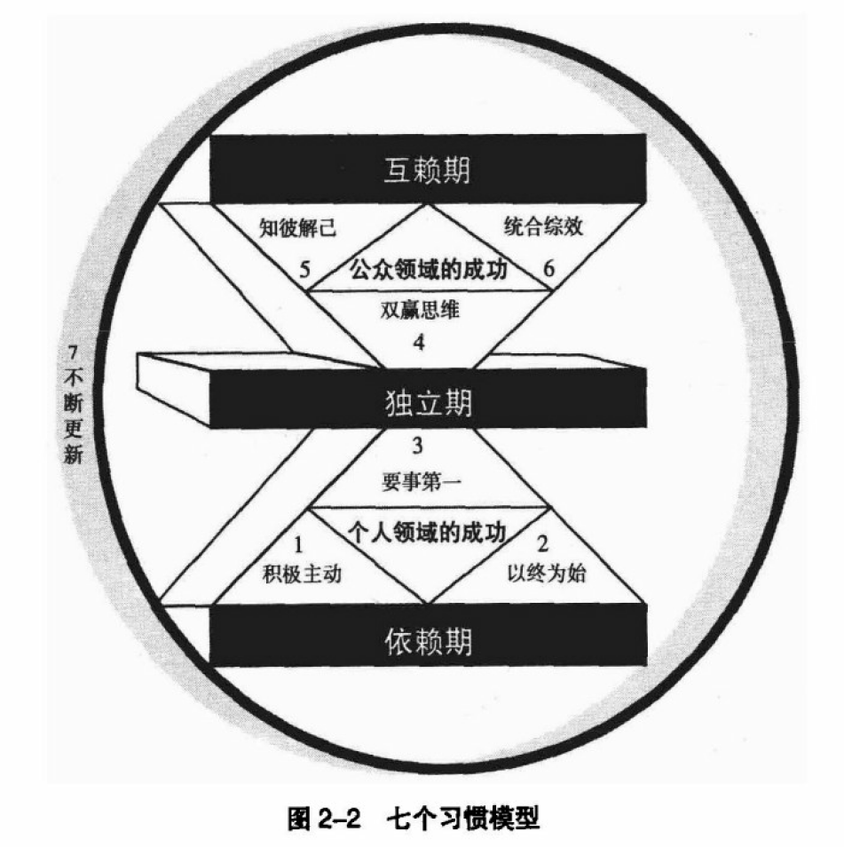

# 长期主义与成长思维

[toc]
<!--toc-->

#### 长期主义与终生学习

- **保持好奇心**
    - 是主动大量阅读的基础.
    - 是因为知识可以让我们更细粒度解构世界.
    - 是因为数理哲学可以让我们思考得更远.
    - 是因为真正享受结构化知识和分享的过程.
- **常开上帝视角**
    - 从量子涨落到宏观实体
    - 从大爆炸到可视宇宙到多维时间线
    - 从原始汤到星球文明到星际文明
    - 从古代到近代到现代到近未来
        - 跳脱出时代去思考问题.人类进入工业时代不过200多年,从莱特兄弟到阿姆斯特朗不到70年,进入信息时代也不过近几十年.对这个时代的大部分人来说,这是个进步的时代,跳过了刀耕火种与黑暗封建,进入到一个发展中的不稳定的初级地球文明时期,冲突与浪潮此起彼伏,精彩纷呈,人工智能和量子计算才刚刚起步.许多厉害的人能够为推动文明的进化与发展贡献自己的一丝智慧与力量,对他们来说这就是个拥有更多开拓机会的好时代.后世会如何评价这个时期呢?古老的地球文明时期.而与此同时,对大部分人来说,这也是个生不逢时的时代,以人为本的人文主义普遍欠缺的时代,除此之外近未来的初级宇宙时代一定会到来,从行星空间到星际空间,社会制度和所有制形式必然会发生结构性改变以适应新的资源分配形势.
        - 跳脱出国家,文化,传统,道德...去思考真正的势和对的事情.
    - 从芯片到主机到程序到非中心化网络
    - 从王侯将相到血泪劳工
    - ...
- **简化生活**
    - 追求自身人格平稳运作的最低成本,将精力放到更重要的事情上.
- **顺势而为**
    - 顺势而为的前提是持续提升综合能力及认知水平.
    - 富在术数不在劳身,利在势局不在力耕. 
    - 保持钝感力,关注感知"势",而非无关紧要的细节.
- **扩展生命的长度以及宽度**
    - 每个人都有自己不同的人生节奏,际遇以及寿命.
    - 拥抱不稳定性. 不要让自己在一件事情上重复10年.
    - 最重要的是以自己的方式度过自己的一生.
- **长期主义**
    - 将一件事情放到10年,20年,30年的长度去思考.摒弃狭隘的悲观与乐观.
    - 腾出时间做自己真正热爱的事情.
    - 能伸能屈,无论需要妥协还是曲线救国,都别忘了你的目标.
- **终生学习**
    - 一以贯之的努力,不得懈怠的人生,才是适用于任何时代的不二法门.
    - 任何时候明白都不算晚.
- **被动收入**
    - 是个人成长的附属品.
    - 是你可以有更多时间做自己真正想做的事情的

---
#### 思维的标准
- 清晰性
    - 能进一步详细描述吗？
    - 能举个例子吗？
    - 能阐明要表达的含义吗？
- 准确性
    - 怎样进行核实？
    - 怎样查明是真的？
    - 怎样查证或证实？
- 精确性
    - 可以更精细一点吗？
    - 能有更多细节吗？
    - 能更精确吗？
- 相关性
    - 它如何与问题相联系？
    - 它如何支持这个问题？
    - 它如何在这个问题上对我们有益？
- 深度
    - 哪些因素提升问题的深度？
    - 这个问题的复杂性是什么？
    - 哪些困难是我们需要着手解决的？
- 广度
    - 需要从另一个视角看问题吗？
    - 需要考虑另一种观点吗？
    - 需要从其他方式看待问题吗？
- 逻辑性
    - 所有这些组合起来有意义吗？
    - 起初的观点符合最后的论述吗？
    - 你所说的有据可依吗？
- 重要性
    - 这是需要考虑的重要问题吗？
    - 这是需要聚焦的中心观点吗？
    - 这些因素哪些是最重要的？
- 公正性
    - 我的想法在情境中合理吗？
    - 我考虑到别人的想法了吗？
    - 我的目的在该情境下公平吗？
    - 我使用概念的方法合理吗？
    - 我是否扭曲了观点来谋取自己的私利？
---
#### 七个习惯概论

- 习惯的定义: 知识、技巧、意愿的结合体
    - 知识: 指点"做什么" "为何做"
    - 技巧: 告诉"如何做"
    - 意愿: 促使"想要做"
    - 三者共同作用, 缺一不可, 从而合为习惯: 知道要做啥, 还要知道该怎么做, 更重要的是愿意去做.
- 成熟模式图(思维成长的三阶段)
    - 依赖: 依赖别人达成愿望与目的——不成熟
    - 独立: 单枪匹马打天下——成熟
    - 互赖: 群策群力达成更高成就——更高层次的成熟
    - 三者依次渐进, 摆脱依赖变得独立是进入互赖模式的基础
- 个人领域与公共领域的关系
    个人领域的完善意味着进入成熟模式的独立期, 你需要培养前三个习惯
    公共领域的完善意味着进入成熟模式的高级互赖阶段, 你需要培养后四个习惯.
- 效能平衡原则
    - 效能在于产能与产出的平衡
    - 产能为生金蛋的资产或能力,产出即金蛋.
    - 三类资产的产能与产出平衡
        - 物质资产
        - 金融资产
        - 人力资产
    - 团体产能也需要满足产能与产出平衡的原则
    - 效能原则是七个习惯的基础
---

