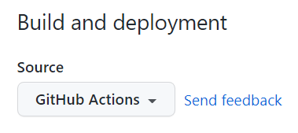

# GitBook简明教程

[toc]
<!-- toc -->

[Gitbook文档](https://docs.gitbook.com/)

#### 安装
- [下载安装node.js](http://nodejs.cn/download/)

- 安装gitbook命令行工具
    ```bash
    npm install gitbook-cli -g
    ```

#### 使用

- `gitbook init` 初始化目录
   - 生成两个必要的文件`README.md`(介绍)和`SUMMARY.md`(结构)
   - 编辑`SUMMARY.md`后可以再次执行该命令生成文件结构(2级)
- `gitbook build`编译为HTML
   - 生成一个`_book`文件夹,包含静态HTML文件
   - 文件名不能包含括号不然无法识别解析
- `gitbook serve`启动本地web服务器
   -  [http://localhost:4000](http://localhost:4000) 预览电子书效果


`SUMMARY.md`可以通过使用 标题 或者 水平分割线 将 GitBook 分为几个不同的部分,如下所示：
```
# Summary
### Part I
* [Introduction](README.md)
* [Writing is nice](part1/writing.md)
* [GitBook is nice](part1/gitbook.md)
### Part II
* [We love feedback](part2/feedback_please.md)
* [Better tools for authors](part2/better_tools.md)
---
* [Last part without title](part3/title.md)
```

#### 编辑器建议
`vscode` 中安装插件`Markdown Preview Enhanced`所见即所得

---

#### [GitBook.com](GitBook.com)

GitBook.com 是一个围绕 gitbook 发行书籍的社区,于 2014 年初创,GitBook.com 提供免费和付费的服务,而且免费账户就可以享受诸多服务,包括：
- 1 本私有书籍
- 托管不限数量的公开书籍
- 售卖不限数量的书籍,并分享 80% 的书籍收入
- 不限数量的协作者
- 免费的在线书籍编辑器

##### Git管理
GitBook.com 上的每本书都使用Git来管理,使用Git提交到书籍的远程项目,当然,提交前,最好在本地使用 gitbook 预览效果.
- `git clone https://git.gitbook.com/testuser/test.git` 克隆
- `git commit -m ".."` 提交
- `git push` 推送发布

书籍地址`https://git.gitbook.com/test_user/test`

##### 配置书籍
GitBook.com上的书籍,进入书籍的属性页面
可以设置,书籍主题,GitHub集成,绑定域名.


- GitHub上创建项目

- 书籍导入到GitHub上的项目
   - 书籍目录下`git remote add github https://github.com/testuser/test.git`

   - `git push -u github master`

git push 命令中的 -u 表示将本地 master 分支的上游分支设置为`github/master`.
 git push 将推送到 github 上,而非原来的 https://git.gitbook.com/testuser/test.git
与此同时原来gitbook上的项目应该会同步拉取/显示github上的更新.

##### 绑定域名
除了可以使用类似`http://test_user.gitbooks.io/test/content/index.html`地址访问用户的书籍外,还可以为每本书另外绑定域名.

- 只能绑定一个合法的域名,不能是域名下的某个地址.
- 域名服务商处为域名添加`CNAME`记录,指向到该书籍地址.
- 可以使用`nslookup test.testuser.cn`来验证是否解析成功.
- 书籍内容类似`http://content.test.test_user.cn`

---

#### 个性化配置
gitbook 在编译书籍的时候会读取书籍源码顶层目录中的 `book.js` 或者 `book.json`.

%accordion%本站的book.json可供参考%accordion%



%/accordion%

*(插件`accordion`+`codesnippet`可以实现上面那样从文件读取代码并折叠)*

##### 插件
可以在[npmjs.com](https://www.npmjs.com/) 上搜索`gitbook-plugin`来查找插件

GitBook默认带有 5 个插件,highlight、search、sharing、font-settings、livereload,如果要去除自带的插件, 可以在插件名称前面加"-",比如：
```json
"plugins": [
    "-search"
]
```
如果要配置使用的插件可以在`book.json`文件中加入即可,比如我们添加`plugin-github`,我们在`book.json`中加入配置如下即可：
```json
{
    "plugins": [ "github" ],
    "pluginsConfig": {
        "github": {
            "url": "https://github.com/your/repo"
        }
    }
}
```
**然后在终端输入 `gitbook install ./` 安装配置中的插件.**

手动安装方式为`npm install gitbook-plugin-插件名`

- `livereload` 自带实时重载
- `ComScore` 是一个彩色主题,默认的 gitbook 主题是黑白的,也就是标题和正文都是黑色的,而 ComScore 可以为各级标题添加不同的颜色,更容易区分各级标题.

- `Disqus` 是一个非常流行的为网站集成评论系统的工具,同样,gitbook 也可以集成 disqus 以便可以和读者交流.
   - 首先,需要在 disqus 上注册一个账号,然后添加一个 website,这会获得一个关键字,然后在集成时配置这个关键字即可.
   - `npm install gitbook-plugin-disqus -g`
   - 修改 book.json 配置文件,添加插件的配置内容：
     ```json
     {
      "plugins": ["disqus"],
      "pluginsConfig": {
          "disqus": {
              "shortName": "获取的唯一key"
          }
       }
     }
     ```

- `gitbook`不支持 `[toc]`,好在有插件可以曲线救国。
    - 在`book.json`中添加插件"toc",运行`gitbook install`
    - 安装完成后，在使用`[toc]`命令的地方使用`<!-- XXX -->`代替(XXX替换为toc)。即可自动生成文档目录。
    - 另外一种方式是安装`anchor-navigation-ex`添加Toc到侧边悬浮导航以及回到顶部按钮.
        ```json
        "pluginsConfig": {
            "anchor-navigation-ex": {
                    "showLevel": false
                }
        }
        ```
- `expandable-chapters-small`可扩展导航章节
- `search-pro` 高级搜索(支持中文)
在使用此插件之前，需要将默认的search和lunr插件去掉.
- `splitter` 侧边栏宽度可调节
- `sharing-plus`分享当前页面，比默认的 sharing 插件多了一些分享方式.
"all"中代表点击分享符号可以显示出来的.
- `tbfed-pagefooter` 页面添加页脚(简单的)
- `page-copyright` 页面页脚版权(内容多)
- `klipse` 嵌入类似IDE的功能,嵌入一块功能，可在代码段中实时交互,即输入代码 > 执行结果
- `donate` 打赏插件
文章最下面的按钮，点击可弹出图片
- `change_girls` 可自动切换的背景图片，time单位秒,url只能使用绝对地址
    ```json
    {
        "plugins":["change_girls"],
        "pluginsConfig": {
            "change_girls" : {
                "time" : 10,
                "urls" : [
                    "girlUrl1", "girlUrl2",...""
                ]
            }
        }
    }
    ```
- `code` 为代码块添加行号和复制按钮
    ```json
    "pluginsConfig": {
      "code": {
        "copyButtons": true
      }
    }
    ```
- `codesnippet` 从文件导入代码并显示
    ```
    //@换成% 指定语言 指定显示的文件行数
    {@ codesnippet "./assets/test.cpp", lines="2:5",language="cpp" @}{@ endcodesnippet @}
    ```



- `checkbox`添加checkbox功能
    - [ ] write some articles
    - [x] drink a cup of tea
- `advanced-emoji`支持Emoji表情 :laughing:
    - [Emoji表情列表](http://www.emoji-cheat-sheet.com/)
- `klipse` 嵌入一块功能，可在代码段中实时交互，即输入代码 > 执行结果

%accordion% klipse详情 %accordion%

- [klipse源码](https://github.com/viebel/klipse) , [klipse插件地址](https://www.npmjs.com/package/gitbook-plugin-klipse)
- 插件支持的语言
```
eval-js for javascript
eval-clojure for clojurescript
eval-scheme for scheme
eval-ruby for ruby
eval-python for python
```
- `ctrl+enter`执行
````
```eval-python
print [x + 1 for x in range(10)]
```
````
- `eval-python`
```eval-python
print [x + 1 for x in range(10)]
```
- `eval-js`
```eval-js
var x = 1;
x + Math.random();
```

- `eval-sql`
```eval-sql
CREATE TABLE play (game, points, day);
INSERT INTO play
VALUES
("go", 500, "monday"),
("go", 300, "tuesday"),
("chess", 1250, "tuesday");
SELECT * FROM play;
```

%/accordion%

- `flexible-alerts` 块增强，4级提示卡片

%accordion% flexible-alerts卡片详情 %accordion%

- `[!NOTE|style:flat]`
    >[!NOTE|style:flat]
    >测试

- `[!TIP|style:flat]`
    >[!TIP|style:flat]
    >测试

- `[!WARNING|style:flat]`
    >[!WARNING|style:flat]
    >测试

- `[!DANGER|style:flat]`
    >[!DANGER|style:flat]
    >测试

- `[!NOTE|style:callout]`
    >[!NOTE|style:callout]
    >测试

- `[!TIP|style:callout]`
    >[!TIP|style:callout]
    >测试

- `[!WARNING|style:callout]`
    >[!WARNING|style:callout]
    >测试

- `[!DANGER|style:callout]`
    >[!DANGER|style:callout]
    >测试

%/accordion%

- `pageview-count` 文章左上角显示阅读量计数
- `accordion` 折叠模块,放最外层不可缩进。可嵌套，内部可以加代码块，引用，标题等
    ```
    %accordion%标题%accordion%
    //需要空一行
    任意内容
    //需要空一行
    %/accordion%
    ```

- `spoiler` 给片段覆盖一层黑色蒙版 刮刮乐
    ```
    {@s%}Hello World.{@ends%} //@改为%
    ```

- `hide-element`可以隐藏不想看到的元素，比如导航栏中`Published by GitBook`
    ```json
    "pluginsConfig": {
            "hide-element": {
                "elements": [".gitbook-link"]
            }
        }
    ```

参考：[GitBook插件整理](https://www.jianshu.com/p/427b8bb066e6)

---

#### 发布到 GitHub Pages
由于 gitbook 书籍可以本地构建出静态HTML格式,所以可以直接将构建好的书籍直接放到GitHub Pages中托管,之后可以通过如下地址访问书籍：
`<username>.github.io/<project>`

只需要4步即可将静态`HTML`文件发布到`gh-pages`:
1. `gitbook build` 在`_book`子目录下生成静态文件
2. `git subtree split --rejoin --prefix=_book --branch gh-pages`拆分子目录到新的分支`gh-pages`
3. `git subtree push --squash --prefix=_book origin gh-pages` 推送到远程仓库
4. 在该github仓库的`settings->pages`中做下图所示修改然后直接通过`<username>.github.io`访问就可以访问到`gh-pages`,即`_book`目录下构建的静态文件

#### 使用`actions workflow`自动部署
`github pages`的默认构建方式是`jekyll`,使用某些gitbook插件时可能会构建失败，从而导致无法继续部署.比如使用`codesnippet`时无法成功构建.这个时候可以通过自定义静态文件构建的方式完成部署.


在`master`分支下新建`.github/workflows/static.yml`(`gitbook build`后会被自动打包到_book目录下,并在`gh-pages`分支的push事件触发时执行静态文件部署工作流.)

%accordion% 在gh-pages分支下新建.github/workflows/static.yml %accordion%



%/accordion%


---

**维护这个库的所有命令都在仓库根目录的`Makefile`里面定义了，可以参考**
