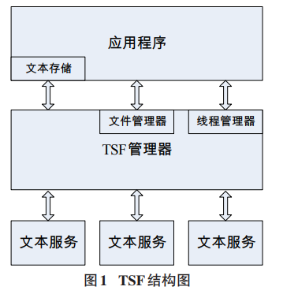
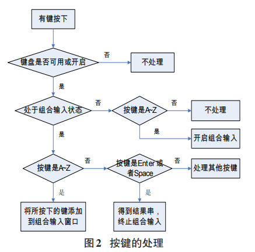
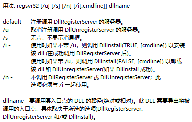

# 基于Windows文本服务框架TSF的输入法实现

[toc]
<!-- toc -->

## 背景
输入法是指为将各种按键序列转化为字符,输入计算机或其他设备(如手机,平板)而采用的编码方案,因此输入法的研究是信息处理的一个重要课题.Windows提供了两套输入法框架:
- 在Windows XP及之前,是`IMM(Input Method Manager)`,即输入法引擎,基于纯函数API;
- Windows XP及以后,提供了新的输入法框架`TSF(Text Service Framework)`,是基于COM(组件对象 模型)的.

目前现有的各个版本输入法大多采用输入法管理器-输入法生成器(IMM-IME)框架进行开发,然而在 Windows 8 系统中 Metro 风格的应用是不支持该框架的,在这些应用下进行输入,需要使用文本服务框架(TSF)开发的输入法.

本文将主要介绍TSF框架的基本构成,输入法的设计以及安装要点.

## TSF的构成和基本工作过程  
### 基本概念 
#### 什么是TSF?
>TSF为高级文本和自然语言输入技术提供了一个简单,可扩展的框架,是一项从 Windows XP 开始提供的设备无关,语言无关的系统服务.TSF与传统 IME 相比虽然对键盘输入法的作用没有太大区别,但是支持 TSF 的应用程序可以从任何支持TSF的文本服务中接收文本输入(例如手写,语音输入),而不用考虑有关文本来源的具体细节. 

#### TSF 体系结构
>TSF 主要由应用程序,文本服务和TSF管理器三个部分组成,其结构如图所示: 
>
>
>
>- 应用程序(Applications):应用程序的任务一般包括显示, 直接编辑以及文本存储,通过实现 COM 服务来提供文本访问的能力. 
>
>- TSF管理器(TSF Manager):作为文本服务与应用程序之间中间层,TSF管理器支持一个应用程序同时建立多个与文本服务之间的联系,共享文本内容.其功能是由操作系统实现的.
>
>- 文本服务(Text Services):向应用程序提供文本,同样用COM实现,内置了注册为TSF的服务过程.多个文本服务允许同时被注册,可以包含文本的输入与输出,还可以作为一段文本的数据和属性的关联体.也可以称为TIP(Text Input Processor),比如输入法提供语音,手写,键盘,翻译输入,那就是4个Tip.

### 与应用程序的交互 
TSF的优点在于其设备无关,语言无关,并且可扩展的特性,同时能够给用户提供一致的输入体验.任何 `TSF-enabled` 的应用程序都能从任何 `Text Service` 接收文本,同时可以输出文本,而不需要知道文本来源的详细信息.同时,文本服务也不需要考虑各种不同应用之间的差别.TSF是应用与IME之间的中介,TSF将输入事件传递给IME并在用户选择字符后接收从IME返回的输入字符.

## 输入法的设计与具体实现 
### 主要接口函数的实现 
与传统 IME 必须要实现的 `ImeInquire`,`ImeConfigure`, `ImeProcessKey`,`ImeToAsciiEx`等接口函数不同,文本服务框架包含了一组新的接口函数,具体实现方法也有所不同.其中一些重要的接口如下: 

- 文本输入处理(`ITfTextInputProcessor`):是创建文本服务需要实现的第一个接口,继承自 `IUnknown` 接口,由TSF管理器调用来实现文本服务的`Activate`与`Deactivate`.

- 线程管理器事件接收器(`ITfThreadMgrEventSink`):该接口允许文本服务来接收与响应事件焦点的变化.在 TSF 中,事件通知由被称之为事件接收器的 COM 对象收取,因此,客户端需要实现一个 `ITfThreadMgrEventSink` 对象,并安装事件接收器, 从而获得线程管理器发送的事件通知.在TSF中,应用程序和文本服务被定义为**客户端**.

- 文档管理器(`ITfDocumentMgr`):文档管理器的作用是管理编辑的内容,每个文档管理器都维护着一个后进先出的缓冲区,通常称之为**内容栈**,用来存储对应的文档管理器所管理的编辑内容列表.

- 语言栏按钮项目信息(`ITfLangBarItemButton`):该接口也继承自 `IUnknown` 接口,实现一些语言栏上按钮项的信息,例如图标,文本,点击弹出的菜单项等.

- 编辑会话(`ITfEditSession`):编辑会话由文本服务实现并由TSF管理器调用来读取或者修改文本和属性的上下文. 

- 输入组合(`ITfComposition`):输入组合接口由TSF管理器实现,同样继承自`IUnknown`接口.应用程序显示什么样的文本,以及是否显示文本,需要获取输入组合的显示属性信息,通过判断输入组合是否存在,将其状态显示给用户. 

- 编辑内容查看对象(`ITfContextView`):文本服务为候选列表创建新的内容后,`ITfContextView`接口的`GetTextExt`方法可返回文本边界框的屏幕坐标.除了以上接口,TSF还有线程管理器(`ITfThreadMgr`),客户端标识符(`ITfClientId`),键盘事件接收器(`ITfKeyEventSink`),属性设置(`ITfProperty`)等一些重要接口需要实现,此处不再一一赘述.

### 输入法的基本实现步骤
#### 创建空白的动态链接库项目
输入法程序实际上就是一个**动态链接库程序** ,只是这个动态链接库较特殊,文件名的后缀是`.ime`而不是`.dll`. 
1. 在`DLL_PROCESS_ATTACH`事件中,使用`RegisterClass`注册用户界面窗口类.可根据个人喜好设计的状态窗口,编码窗口以及候选窗口的属性.

2. 在`DLL_PROCESS_DETACH`事件中,注销上述注册的窗口对象并释放该对象使用的所有系统资源.

#### 文本服务模块的设计

用户可使用语言栏或键盘来与文本服务进行交互,因此首先要创建一个文本服务并将其注册.**要使文本服务被应用程序所使用,需要将其注册为标准COM嵌入进程服务项,即注册到文本服务框架中**.TSF通过`ITfInputProcessorProfiles`与 `ITfCategoryMgr`两个接口来提供简单的注册过程支持.

线程管理器(`ITfThreadMgr`)是`TSF Manager`的基本组成部分,完成应用程序与客户端之间进行联系的公共任务,包括跟踪输入焦点的改变.同时线程管理器还负责向客户端发送事件通知,客户端通过实现`ITfThreadMgrEventSink`对象,并使用 `ITfSource::AdviseSink`方法安装事件接收器,获得事件通知. 

文本服务使用文档管理器获取编辑内容,`ITfTextEditSink`接口允许文本服务接收与响应焦点变化事件,对于一个文本服务或者应用程序来说,这个接口的实现是可选的. 

需要注意的是,IME必须与系统任务栏兼容.任务栏仅为兼容的IME显示其图标,对于不兼容的则无法显示.我们需要将IME图标存储在DLL或EXE文件中,而不是独立的`.ico`文件中.

#### 完成按键的映射

除了语言,手写识别,最常用的仍然是键盘的识别.按键的映射是输入法设计的一个重要部分,顾名思义,也是我们最熟悉的一个部分,这里通过虚键实现对一般按键与功能按键的响应,来完成输入过程. 

首先需要使用Windows宏`MAKELANGID`创建语言标识符,它包含一个主要语言标识符与一个从语言标识符,返回值同样也是语言标识符,通过 `ITfInputProcessorProfileMgr`的`RegisterProfile`方法来实现注册.对于拼音输入法,使用`MAKELANGID(LANG_CHINESE,SUBLANG_CHINESE_SIMPLIFIED)` 即可. 

按键事件的处理受到几个因素的影响:键盘可用状态,键盘开启状态,输入状态,空闲状态,中英文状态等等,在TSF中, 公共缓冲池为数据共享提供了数据存储和消息处理的机制,以支持客户端程序之间的数据共享.对于键盘来说,公共缓冲池 `GUID_COMPARTMENT_KEYBOARD_DISABLED`针对的是编辑内容,是预定义的,如果它的值为非零值,那么键盘不可用;而`GUID_COMPARTMENT_KEYBOARD_OPENCLOSE`针对 的是线程管理器,如果它为非零值,那么键盘处于开启状态. 我们通过 `ITfCompartmentMgr`接口的`GetCompartment`方法来检查键盘是否可用.

关于按键的处理如图所示: 

接下来实现`ITfKeyEventSink`接口来处理击键事件,该接口包含了`OnKeyDowm`,`OnKeyUp`,`OnSetFocus`等方法分别处理按键按下,按键弹起与一个TSF文本服务接收或者失去键盘焦点时的事件.同时,`ITfKeystrokeMgr`接口也同样重要,它允许文本服务与键盘管理器的交互.

#### 输入组合与候选列表的处理

文本服务通过调用`ITfContextComposition::StartComposition`方法创建输入组合,并通过创建`ITfCompositionSink`对象接收输入组合的事件消息,使用 `ITfContextComposition::EndComposition`方法来结束输入组合. 

在创建输入组合的同时,文本服务需要提供在应用程序中区别组合输入文本与常规文本的显示属性支持,通过在`TF_DISPLAYATTRIBUTE`结构中定义文本前景色,背景色,下 划线的样式,色彩,粗细等,来实现显示属性的提供.首先需要调用 `ITfCategoryMgr::RegisterCategory`方法,把文本服务注册为服务提供者,然后实现`ITfDisplayAttributeProvider`与`IEumTfDisplayAttributeInfo`接口并使它们可用,最后为文本服务提供的每种显示属性实现一个 `ITfDisplayAttributeInfo`对象. 

接下来是关于候选列表的处理,用户输入字符后,输入法需要提供一个合适的候选列表以便用户从中选择结果串.创建一个候选列表首先要实现候选窗口的创建与注册,然后完成事件的处理部分,如翻页,选择等,最后实现窗口的销毁和隐藏.需要通过`ITfTextLayoutSink`,`ITfIntegratableCandidtateListUIElement`等接口一一实现.

#### 把文本服务注册为标准COM进程服务项
基于TSF框架的输入法实际上是一个COM程序,也就是说微软为我们提供了很多的虚基类,然后我们需要实现一个COM程序.`CClassFactory`类需要能够创建实现`ITfTextInputProcessor`接口的对象,所有进程内COM服务器(`InProcess COM Server`)输出四个标准函数:

- `DllRegisterServer` : 用Windows注册表来注册COM对象
- `DllUnRegisterServer` : 解注册
- `DllGetClassObject` : 返回`CClassFactory`类的实例
- `DllCanUnloadNow` : COM调用,检查是否可以从内存中卸载COM服务器.

我们需要在模块定义文件`.def`中导出这四个接口函数,这样才能够将输入法在系统中注册.

## 输入法的安装要点 
关于输入法ime有两种安装方式: 
- 使用第三方安装程序,导入自己的词库与所生成的ime文件,创建一个 `Setup.exe`文件,从而可以让用户安装自己编写的IME.

- 使用`Regsvr32`命令.`Regsvr32`命令用于注册COM组件,是Windows系统提供的用来向系统注册或者卸载控件的命令,以命令行方式运行.具体步骤是将所生成的输入法.ime文件拷贝到系统System文件夹下,然后在cmd下运行`Regsvr32 输入法.ime`即可.但是这种方式会有一些问题,输入法的图标无法使用,不过不影响测试.

- 检查是否注册成功.win10系统下,设置->语言->选项->添加键盘,可以查看是否功能正常

## 总结
作为新一代输入法框架,TSF是一个允许进行高级的,来源无关的文本输入的应用编程接口,它为高级文本和自然语言输入技术提供了一个简单和可扩展的框架.关于图标不能显示的问题还有待解决,另外, 对于一个完整的输入法来说还有软键盘,鼠标输入,系统图标, 菜单设置,输入法皮肤等方面需要一一实现,同时,输入效率也是一个不容忽视的部分,有关输入转换算法还需要进一步的研究.

Github上有一些开源输入法例如跨平台的`RIME`可做参考.